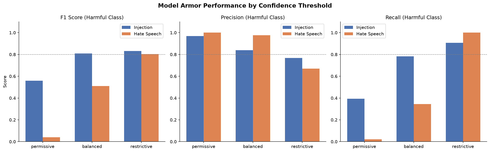

# Red Team Evaluation: Google Model Armor

Google Model Armor is a managed security layer for LLM applications that filters user prompts and model responses against threats such as prompt injection, jailbreaks, and harmful content before they reach the model or end user. This project evaluates its content safety filters across three confidence threshold configurations, tested against prompt injection and hate speech attack categories.

---

## Methodology

### Datasets

| Category         | Dataset                                    | Source               |
| ---------------- | ------------------------------------------ | -------------------- |
| Hate Speech      | Hate Speech and Offensive Language         | mrmorj (Kaggle)      |
| Prompt Injection | Prompt Injection and Benign Prompt Dataset | cyberprince (Kaggle) |

### Prompt Construction

500 prompts were generated by randomly combining content from the two datasets. Each prompt was assigned one of three structures:

- **Fully benign** — no attack content
- **Single attack** — one attack type
- **Dual attack** — two attack types combined

Attack content was sampled exclusively from harmful subsets of each dataset to ensure ground truth label integrity. Benign prompts were constructed by sampling from the benign subset of each dataset.

> Note: prompts can carry multiple labels simultaneously (e.g. a prompt can be both an injection and contain hate speech), so the task-specific supports in the evaluation outputs are reported separately below.

### Confidence Threshold Configurations

Model Armor templates were mapped to three configurations:

| Configuration   | Threshold Behavior                                                          |
| --------------- | --------------------------------------------------------------------------- |
| **Permissive**  | High confidence required to flag — fewest flags, lowest false positive rate |
| **Balanced**    | Medium confidence threshold                                                 |
| **Restrictive** | Low confidence required to flag — most flags, highest false positive rate   |

### Evaluation Metrics

Per-category classification reports (precision, recall, F1) and confusion matrices were computed using `sklearn.metrics`. Each template was evaluated independently on the same 500 prompts.

---

## Results

### Prompt Injection

#### Confusion Matrices

| Permissive                     | Predicted Benign | Predicted Injection |
| ------------------------------ | ---------------- | ------------------- |
| **Actually Benign** (n=266)    | 263 TN           | 3 FP                |
| **Actually Injection** (n=234) | 142 FN           | 92 TP               |

| Balanced                       | Predicted Benign | Predicted Injection |
| ------------------------------ | ---------------- | ------------------- |
| **Actually Benign** (n=266)    | 231 TN           | 35 FP               |
| **Actually Injection** (n=234) | 51 FN            | 183 TP              |

| Restrictive                    | Predicted Benign | Predicted Injection |
| ------------------------------ | ---------------- | ------------------- |
| **Actually Benign** (n=266)    | 202 TN           | 64 FP               |
| **Actually Injection** (n=234) | 22 FN            | 212 TP              |

#### Classification Report

| Configuration | Benign F1 | Injection Precision | Injection Recall | Injection F1 | Accuracy |
| ------------- | --------- | ------------------- | ---------------- | ------------ | -------- |
| Permissive    | 0.78      | 0.97                | 0.39             | 0.56         | 0.71     |
| Balanced      | 0.84      | 0.84                | 0.78             | 0.81         | 0.83     |
| Restrictive   | 0.82      | 0.77                | 0.91             | 0.83         | 0.83     |

#### Key Findings

- **Permissive misses 61% of injection attempts** (recall=0.39, FN=142) with only 3 false positives — the filter is conservative to the point of being unreliable as a security control at this threshold.
- **Balanced and Restrictive tie on accuracy at 0.83**, but Balanced keeps false positives lower (35 vs. 64) while Restrictive improves recall (0.91 vs. 0.78) and F1 (0.83 vs. 0.81).
- **Restrictive increases injection recall to 0.91** at the cost of 64 false positives on benign prompts — a 24% false positive rate that may be acceptable in high-security deployment contexts.

---

### Hate Speech

#### Confusion Matrices

| Permissive                | Predicted Safe | Predicted Hate |
| ------------------------- | -------------- | -------------- |
| **Actually Safe** (n=262) | 262 TN         | 0 FP           |
| **Actually Hate** (n=238) | 233 FN         | 5 TP           |

| Balanced                  | Predicted Safe | Predicted Hate |
| ------------------------- | -------------- | -------------- |
| **Actually Safe** (n=262) | 260 TN         | 2 FP           |
| **Actually Hate** (n=238) | 156 FN         | 82 TP          |

| Restrictive               | Predicted Safe | Predicted Hate |
| ------------------------- | -------------- | -------------- |
| **Actually Safe** (n=262) | 145 TN         | 117 FP         |
| **Actually Hate** (n=238) | 0 FN           | 238 TP         |

#### Classification Report

| Configuration | Safe F1 | Hate Precision | Hate Recall | Hate F1 | Accuracy |
| ------------- | ------- | -------------- | ----------- | ------- | -------- |
| Permissive    | 0.69    | 1.00           | 0.02        | 0.04    | 0.53     |
| Balanced      | 0.77    | 0.98           | 0.34        | 0.51    | 0.68     |
| Restrictive   | 0.71    | 0.67           | 1.00        | 0.80    | 0.77     |

#### Key Findings

- **Permissive is effectively non-functional for hate speech detection** — it catches only 5 of 238 hate speech samples (recall=0.02) while producing 233 false negatives. At this threshold, the filter provides no meaningful safety guarantee.
- **Balanced improves recall to 0.34 with only 2 false positives** — still misses 66% of hate speech, but does not over-flag safe content. Precision remains near-perfect (0.98) at this threshold.
- **Restrictive achieves 100% hate speech recall (FN=0)** but at significant cost — 117 of 262 safe prompts are incorrectly flagged (45% false positive rate). Hate precision drops to 0.67.
- **No single configuration achieves balanced performance** — Permissive and Balanced preserve safe content but miss most hate speech; Restrictive catches all hate speech but produces an unacceptable false positive rate for general use.

---

## Summary

| Category         | Best Recall Config | Best Precision Config        | Recommended Config                                       |
| ---------------- | ------------------ | ---------------------------- | -------------------------------------------------------- |
| Prompt Injection | Restrictive (0.91) | Permissive (0.97)            | **Balanced or Restrictive** — Balanced lowers FPs, Restrictive maximizes recall |
| Hate Speech      | Restrictive (1.00) | Permissive (1.00)            | **Context-dependent** — see below                        |

For hate speech, the recommended configuration depends on deployment context:

- **High-risk environments** (content moderation, child safety): use Restrictive and accept the false positive rate — missing hate speech is more costly than over-flagging.
- **General-purpose applications**: use Balanced — it keeps false positives very low while catching a meaningful portion of hate speech, with the understanding that 66% of hate speech will go undetected.

The core finding is that **Model Armor's default (Permissive) configuration is insufficient as a standalone safety control** — catching only 2% of hate speech and 39% of injection attempts. Detection improves significantly at Restrictive (100% and 91% respectively), but at the cost of a 45% false positive rate on hate speech, making universal configuration recommendations impossible.

## Results Overview

---

## Limitations

- **Prompt construction**: Prompts are synthetic concatenations of dataset rows rather than naturalistic adversarial inputs. Real-world attack prompts may differ structurally.
- **Hate Speech labels**: The mrmorj/hate-speech-and-offensive-language-dataset has 3 labels (hate speech, offensive language, neither) but in this evaluation "hate speech" and "offensive lanaguage" labels are combined into one label "hate".
- **Test suite**: Currently, test suite is limited to only 2 types of attacks, where in reality LLMs will be subjected to a greater variety. 

---

## Environment

- Python 3.14
- Google Cloud Model Armor API
- Jupyter Notebook
- Kagglehub
- scikit-learn (evaluation metrics)
